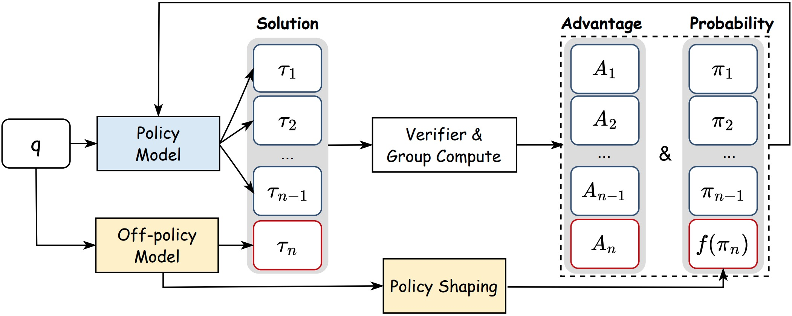
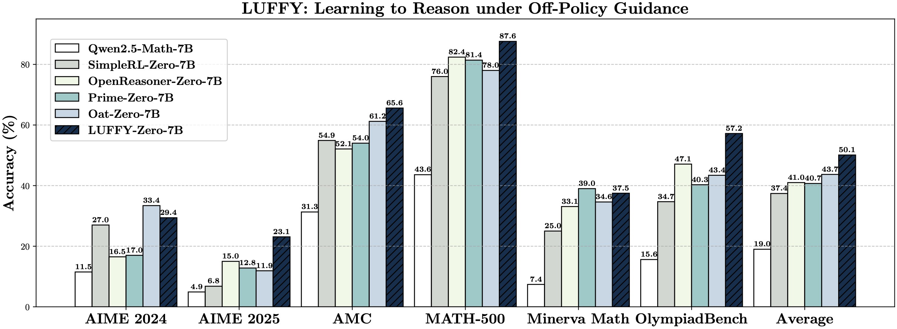

<div align="center">


<h1 style="display: flex; justify-content: center; align-items: center; gap: 10px; margin: 0;">
  
  LUFFY: Learning to Reason Under Off‑Policy Guidance
</h1>
<p align="center"><em>A general framework for off-policy learning in large reasoning models.</em></p>

<div align="center">
  
</div>


[](http://arxiv.org/abs/2504.14945) [](https://www.alphaxiv.org/abs/2504.14945) [](https://github.com/ElliottYan/LUFFY)   [](https://huggingface.co/collections/Elliott/luffy-rl-6804e1f5d1ebe66ba8ac92f4) [](https://x.com/yafuly/status/1914559433549676962)


</div>

---

# 📚 Overview
- 🎉 [News](#news)  
- 📖 [Introduction](#introduction)  
- ✨ [Getting Started](#getting-started)  
- 🔧 [Usage](#usage)  
- 📃 [Evaluation](#evaluation)  
- 🎈 [Citation](#citation)  
- 🌻 [Acknowledgement](#acknowledgement)  
<!-- - 📈 [Star History](#star-history) -->


---


# 🎉News
- **[2026/01/26]** 🎉 ExGRPO has been accepted to **ICLR 2026**!
- **[2025/10/04]** 🚀 Introducing [ExGRPO](https://github.com/ElliottYan/LUFFY/tree/main/ExGRPO), a new variant that boosts performance by **learning from the model’s own off-policy experience**, without relying on external guidance.
- **[2025/09/19]** 🎉 LUFFY has been accepted to **NeurIPS 2025**!
- **[2025/05/30]** We integrate the implementation and scripts of other off-policy learning methods including SFT, SFT+RL and RL w/ SFT Loss (multi-task learning).
- **[2025/05/21]** We have updated the paper [version](https://arxiv.org/abs/2504.14945), which re-evaluates all models using a more accurate verifier and adds comparisons with other off-policy learning methods, including RL with SFT Loss and SFT+RL.
- **[2025/04/23]** Our paper now trending on [alphaXiv](https://www.alphaxiv.org/abs/2504.14945)! We welcome feedback and discussion.
- **[2025/04/23]** 🎉 Ranked **#1** of the day on [Huggingface Daily Papers](https://huggingface.co/papers/2504.14945).
- **[2025/04/20]** LUFFY paper available on [arXiv](http://arxiv.org/abs/2504.14945). 

<!-- - **[2025/04/20]** The models and datasets are released on [HuggingFace](https://huggingface.co/collections/Elliott/luffy-rl-6804e1f5d1ebe66ba8ac92f4).
- **[2025/04/20]** LUFFY codebase is released along with evaluation scripts. Try it out! -->

---

# 📖Introduction

LUFFY is a reinforcement learning framework that bridges the gap between zero-RL and imitation learning by incorporating off-policy reasoning traces into the training process. Built upon GRPO, LUFFY combines on-policy rollouts with off-policy demonstrations during advantage estimation and introduces **policy shaping** via regularized importance sampling to emphasize low-probability yet crucial actions.



### Key Highlights:
- **Off-Policy Guidance:** Seamlessly integrates external reasoning traces to bootstrap learning from stronger models.
- **Dynamic Balance:** Learns when to imitate and when to explore, adapting over the course of training.
- **Policy Shaping:** Emphasizes important actions often ignored in standard policy gradients, enabling better generalization.


---

# ✨Getting Started

## Installation

You can install LUFFY dependencies by running the following commands:
```bash
conda create -n luffy python=3.10
conda activate luffy
cd luffy
pip install -r requirements.txt
pip install -e .
cd verl
pip install -e .
```

### Update 9.8
Recently, we find the deprecation of pyairports caused a lot of environment issues. Thus, we now provide a bit more complicated way for installing the environment. 
```bash
conda create -n luffy python=3.10
conda activate luffy
pip install airports-py
git clone https://github.com/dottxt-ai/outlines.git
cd outlines
git checkout 0.0.46
pip install .
cd ../luffy
pip install -r requirements.v2.txt
pip install -e .
cd verl
pip install -e .
```


If you encounter issues when installing flash-attn, we recommend you to install it here 
[flash-attn](https://github.com/Dao-AILab/flash-attention/releases/tag/v2.7.3). For example, we use this version. 
```bash
wget https://github.com/Dao-AILab/flash-attention/releases/download/v2.7.3/flash_attn-2.7.3+cu12torch2.4cxx11abiFALSE-cp310-cp310-linux_x86_64.whl
pip install flash_attn-2.7.3+cu12torch2.4cxx11abiFALSE-cp310-cp310-linux_x86_64.whl
```

## Repo Structure

This repository includes:

- `luffy`: Codes for training LUFFY using off-policy reasoning traces. Our main code changes are in luffy/verl/verl/mix_src.
- `data`: Data and code for training and evaluating LUFFY. 
- `exp_scripts`: Example script to train LUFFY.
- `eval_scripts`: Evaluation scripts on math and out-of-distribution benchmarks.
- `ExGRPO`: Implementation and notes for ExGRPO, which leverages off-policy experience replay to further boost performance without external guidance.

LUFFY is built on top of the GRPO framework and supports plug-and-play integration with off-policy traces from models such as DeepSeek-R1.

---


# 🔧Usage

## Data Preparation
You need to first run the data preparation script to get the training data in parquet format.
```bash
cd data
python prepare_train.py
```

## Training

We provide an example script to train LUFFY on our subset of OpenR1-Math-220k. You can run the following command to train LUFFY:

```bash
  cd exp_scripts
  bash train.sh
```

## Other Off-Policy Baselines
### SFT
First clone the OpenRLHF repository and prepare the data to SFT format. *(We plan to integrate the SFT pipeline directly into LUFFY in the near future.)*
```bash
git clone https://github.com/OpenRLHF/OpenRLHF
cd data
python prepare_sft.py
```
Then, you can run the SFT training command. 
```
RESULT_DIR="Your result directory"
DATA_DIR="Your data directory"
WANDB_KEY="Your Wandb Key"

MODEL_PATH=Elliott/Qwen2.5-Math-7B-16k-think
MASTER_ADDR=`scontrol show hostname $SLURM_JOB_NODELIST | head -n1`
MASTER_PORT=$((RANDOM % 101 + 20000))
DEVICES="0,1,2,3,4,5,6,7"
deepspeed --master_port=$MASTER_PORT --master_addr=$MASTER_ADDR --include localhost:$DEVICES --module openrlhf.cli.train_sft \
   --max_len 16384 \
   --dataset $DATA_DIR \
   --input_key prompt \
   --output_key target \
   --train_batch_size 64 \
   --apply_chat_template \
   --micro_train_batch_size 1 \
   --max_samples 500000 \
   --pretrain $MODEL_PATH \
   --save_path $RESULT_DIR \
   --logging_steps 1 \
   --eval_steps -1 \
   --zero_stage 2 \
   --max_epochs 3 \
   --adam_offload \
   --packing_samples \
   --bf16 \
   --flash_attn \
   --save_hf_ckpt \
   --learning_rate 5e-5 \
   --lr_warmup_ratio 0.1 \
   --wandb_project r1_sft_distill \
   --wandb_run_name qwen-7b-base-sft \
   --use_wandb $WANDB_KEY \
   --gradient_checkpointing
```


### RL w/ SFT Loss
```bash
  cd exp_scripts
  bash train_rl_sft_loss.sh
```

### SFT + RL
We use heldout data for RL training, following previous works like PRIME.
```bash
  cd data
  python prepare_train_sft_rl.py
  cd ../exp_scripts
  bash train_sft_rl.sh
```

## Inference

Here’s an example of using LUFFY for inference:

<details>
<summary>Click to view inference example</summary>

```python
from transformers import AutoTokenizer
from vllm import LLM, SamplingParams

model_path="Elliott/LUFFY-Qwen-Math-7B-Zero"

question = "which number is larger? 9.11 or 9.9?"

tokenizer = AutoTokenizer.from_pretrained(model_path)
messages = [{"role": "user", "content": question}]
chat = tokenizer.apply_chat_template(messages, tokenize=False, add_generation_prompt=True)

llm = LLM(model=model_path)
params = SamplingParams(temperature=0.6, max_tokens=8192)
outputs = llm.generate([chat], params)
print(outputs[0].outputs[0].text)
```

</details>


## Models

| **Model**                          | **Huggingface** |  **Base Model** |
|-----------------------------------|------------------|------------------|
| LUFFY-Qwen-Math-7B-Zero | https://huggingface.co/Elliott/LUFFY-Qwen-Math-7B-Zero |  Qwen2.5-Math-7B |
| LUFFY-Qwen-Math-7B-SFT | https://huggingface.co/Elliott/Qwen2.5-Math-7B-SFT | Qwen2.5-Math-7B |
| LUFFY-Qwen-Math-7B-SFT-RL | https://huggingface.co/Elliott/Qwen2.5-Math-7B-SFT-RL | Qwen2.5-Math-7B |
| LUFFY-Qwen-Math-1.5B-Zero | https://huggingface.co/Elliott/LUFFY-Qwen-Math-1.5B-Zero | Qwen2.5-Math-1.5B |
| LUFFY-Qwen-Instruct-7B | https://huggingface.co/Elliott/LUFFY-Qwen-Instruct-7B | Qwen2.5-7B-Instruct |

---

# 📃Evaluation

## Reproducing the Results 
We currently support automated evaluation on six widely used mathematical reasoning benchmarks (AIME24/25, AMC, MATH-500, Minerva, and Olympiad) and three out-of-distribution tasks (ARC-c, GPQA-diamond, and MMLU-pro). The platform provides specialized system prompts for a range of RL models, including LUFFY, SimpleRL, OpenReasoner, PRIME, and OAT.

You can reproduce our results by running the following commands:
```bash
ROOT=YOUR_ROOT_PATH
DATA=$ROOT/data/valid.all.parquet

OUTPUT_DIR=./results/
mkdir -p $OUTPUT_DIR

# If you want to evaluate other models, you can change the model path and name.
MODEL_PATH=Elliott/LUFFY-Qwen-Math-7B-Zero
MODEL_NAME=luffy

if [ $MODEL_NAME == "eurus-2-7b-prime-zero" ]; then
  TEMPLATE=prime
elif [ $MODEL_NAME == "simple-rl-zero" ]; then
  TEMPLATE=qwen
else
  TEMPLATE=own
fi

CUDA_VISIBLE_DEVICES=0,1,2,3 python eval_scripts/generate_vllm.py \
  --model_path $MODEL_PATH \
  --input_file $DATA \
  --remove_system True \
  --add_oat_evaluate True \
  --output_file $OUTPUT_DIR/$MODEL_NAME.jsonl \
  --template $TEMPLATE > $OUTPUT_DIR/$MODEL_NAME.log
```


## LUFFY on Qwen2.5-Math-7B (zero-RL)
LUFFY is evaluated on six competition-level benchmarks, achieving state-of-the-art results among all zero-RL methods. It surpasses both on-policy RL and imitation learning (SFT), especially in generalization:


| **Model**                          | **AIME 2024** | **AIME 2025** | **AMC** | **MATH-500** | **Minerva** | **Olympiad** | **Avg.** |
|-----------------------------------|-------------|-------------|---------|---------------|-------------|---------------|----------|
| Qwen2.5-Math-7B                      |11.5 | 4.9 | 31.3 | 43.6 | 7.4 | 15.6 | 19.0 |
| Qwen2.5-Math-7B-Instruct             |12.5  | 10.2 | 48.5 | 80.4 | 32.7 | 41.0 | 37.6   |
| SimpleRL-Zero                     | 27.0 | 6.8  | 54.9 | 76.0 | 25.0 | 34.7 | 37.4     |
| OpenReasoner-Zero                 | 16.5 | 15.0 | 52.1 | 82.4 | 33.1 | 47.1 | 41.0    |
| PRIME-Zero                        | 17.0 | 12.8 | 54.0 | 81.4 | **39.0** | 40.3 | 40.7    |
| Oat-Zero                          | **33.4**  | 11.9 | 61.2 | 78.0 | 34.6 | 43.4 | 43.7   |
| **LUFFY-Qwen-Math-7B-Zero**                         | 29.4        | **23.1**        | **65.6**| **87.6**      | 37.5        | **57.2**      | **50.1** |

---


LUFFY also generalizes well to out-of-distribution tasks, with over +6.2 average gain on ARC-C, GPQA, and MMLU-Pro.


| **Model**                         | **ARC-c** | **GPQA-diamond** | **MMLU-Pro** | **Avg.** |
|----------------------------------|-----------|------------------|--------------|----------|
| Qwen2.5-Math-7B             | 18.2 | 11.1 | 16.9 | 15.4  |
| Qwen2.5-Math-7B-Instruct         | 70.3 | 24.7 | 34.1 | 43.0    |
| SimpleRL-Zero                    | 30.2 | 23.2 | 34.5 | 29.3     |
| OpenReasoner-Zero                       | 66.2 | 29.8 | 58.7 | 51.6     |
| PRIME-Zero                         | 73.3 | 18.2 | 32.7 | 41.4   |
| Oat-Zero                | 70.1 | 23.7 | 41.7 | 45.2    |
| **LUFFY-Qwen-Math-7B-Zero**                        | **80.5** |  **39.9** | **53.0** | **57.8** |


We further compare LUFFY with alternative off-policy learning methods, including SFT, RL w/ SFT Loss and SFT+RL (see our paper for details):

| **Model**                          | **GPU Hours** | **Data Usage (On/Off)** | **AIME 2024** | **AIME 2025** | **AMC** | **MATH-500** | **Minerva** | **Olympiad** | **Avg.** |
|-----------------------------------|-------------|-------------|-------------|-------------|---------|---------------|-------------|---------------|----------|
| SFT                      | 24*8 | 0 / 64k | 22.2 | 22.3 | 52.8 | 82.6 | 40.8 | 43.7 | 44.1 |
| RL w/ SFT Loss             |  133*8    | 64k*7 / 64k  |  19.5 | 16.4 | 49.7 | 80.4 | 34.9 | 39.4 | 40.1  |
| SFT+RL                      | 130*8 |  64k*8/135k |  25.8 | **23.1** | 62.7 | 87.2 | 39.7 | 50.4 | 48.2 |
| **LUFFY-Qwen-Math-7B-Zero**            | 77*8 | 64k*7 / 64k              | 29.4        | **23.1**        | 65.6 | **87.6**      | 37.5        | **57.2**      | 50.1 |
| **LUFFY-Qwen-Math-7B-Zero-Extra**       |    130*8       |   110k*7 / 110k      | **30.7** | 22.5 | **66.2**|  86.8 | **41.2** | 55.3 | **50.4** |

---

## LUFFY on Qwen2.5-Math-1.5B
| **Model**                          | **AIME 2024** | **AIME 2025** | **AMC** | **MATH-500** | **Minerva** | **Olympiad** | **Avg.** |
|-----------------------------------|-------------|-------------|---------|---------------|-------------|---------------|----------|
| Qwen2.5-Math-1.5B                  |   7.2 |  3.6 | 26.4 | 28.0 | 9.6 | 21.2 | 16.0 |
| Qwen2.5-Math-1.5B-Instruct            |  12.1 | 8.9 | 48.1 | 77.4 | 28.7 | 39.1 | 35.7 |
| **LUFFY-Qwen-Math-1.5B-Zero**             | **16.0** | **13.1** | **47.1** | **80.2** | **30.5** | **41.0** | **38.0** |


## LUFFY on Qwen2.5-Instruct-7B 
| **Model**                          | **AIME 2024** | **AIME 2025** | **AMC** | **MATH-500** | **Minerva** | **Olympiad** | **Avg.** |
|-----------------------------------|-------------|-------------|---------|---------------|-------------|---------------|----------|
| Qwen2.5-7B-Instruct           | 11.7 | 7.5 | 43.8 | 71.8 | 30.9 | 40.4|  34.4|
| **LUFFY-Qwen-Instruct-7B**             | **17.7** |  **14.8** | **50.9** | **82.0** | **31.3** | **47.4** | **40.7** |


---

### 📝 Complete TODO List

- `ExGRPO/exgrpo/verl/examples/split_placement/split_monkey_patch.py:141` — make a canonical logger that supports various backend
- `ExGRPO/exgrpo/verl/tests/e2e/check_results.py:21` — this function needs error handling
- `ExGRPO/exgrpo/verl/tests/model/test_transformer.py:22` — sgm): add more models for test
- `ExGRPO/exgrpo/verl/tests/model/test_transformer.py:50` — sgm): we can construct the position_ids_rmpad here
- `ExGRPO/exgrpo/verl/tests/model/test_transformer.py:111` — sgm): we can construct the position_ids_rmpad here
- `ExGRPO/exgrpo/verl/tests/model/test_transformers_ulysses.py:34` — sgm): add more models for test
- `ExGRPO/exgrpo/verl/tests/model/test_transformers_ulysses.py:81` — sgm): we can construct the position_ids_rmpad here
- `ExGRPO/exgrpo/verl/tests/model/test_transformers_ulysses.py:159` — sgm): we can construct the position_ids_rmpad here
- `ExGRPO/exgrpo/verl/tests/ray/test_high_level_scheduling_api.py:25` — pass *args and **kwargs is bug prone and not very convincing
- `ExGRPO/exgrpo/verl/tests/ray/test_worker_group_basics.py:43` — pass *args and **kwargs is bug prone and not very convincing
- `ExGRPO/exgrpo/verl/verl/mix_src/mix_fsdp_worker.py:54` — sgm): support FSDP hybrid shard for larger model
- `ExGRPO/exgrpo/verl/verl/mix_src/mix_fsdp_worker.py:83` — it seems that manual offload is slowly than FSDP offload
- `ExGRPO/exgrpo/verl/verl/mix_src/mix_fsdp_worker.py:123` — zhangchi.usc1992): 1. support create from random initialized model. 2. Support init with FSDP directly
- `ExGRPO/exgrpo/verl/verl/mix_src/mix_fsdp_worker.py:199` — zhangchi.usc1992, shengguangming) fix me. Current, auto_wrap_policy causes HFRollout to hang in Gemma
- `ExGRPO/exgrpo/verl/verl/mix_src/mix_fsdp_worker.py:207` — add transformer policy
- `ExGRPO/exgrpo/verl/verl/mix_src/mix_fsdp_worker.py:226` — add more optimizer args into config
- `ExGRPO/exgrpo/verl/verl/mix_src/mix_fsdp_worker.py:252` — sgm): support FSDP hybrid shard for larger model
- `ExGRPO/exgrpo/verl/verl/mix_src/mix_fsdp_worker.py:263` — a sharding manager that do nothing?
- `ExGRPO/exgrpo/verl/verl/mix_src/mix_fsdp_worker.py:426` — here, we should return all metrics
- `ExGRPO/exgrpo/verl/verl/mix_src/mix_fsdp_worker.py:586` — support DCP and save sharded checkpoints
- `ExGRPO/exgrpo/verl/verl/mix_src/mix_trainer.py:90` — add other ways to estimate advantages
- `ExGRPO/exgrpo/verl/verl/mix_src/mix_trainer.py:150` — support each role have individual ray_worker_group_cls,
- `ExGRPO/exgrpo/verl/verl/mix_src/mix_trainer.py:197` — we have to make sure the batch size is divisible by the dp size
- `ExGRPO/exgrpo/verl/verl/mix_src/mix_trainer.py:508` — make a canonical logger that supports various backend
- `ExGRPO/exgrpo/verl/verl/mix_src/mix_trainer.py:552` — add response length
- `ExGRPO/exgrpo/verl/verl/mix_src/mix_trainer_acc_rebatch.py:63` — we have to make sure the batch size is divisible by the dp size
- `ExGRPO/exgrpo/verl/verl/mix_src/mix_trainer_acc_rebatch.py:437` — make a canonical logger that supports various backend
- `ExGRPO/exgrpo/verl/verl/mix_src/mix_trainer_acc_rebatch.py:592` — check path
- `ExGRPO/exgrpo/verl/verl/mix_src/mix_trainer_acc_rebatch.py:628` — from remote not implemented yet
- `ExGRPO/exgrpo/verl/verl/mix_src/mix_trainer_experience.py:64` — support each role have individual ray_worker_group_cls,
- `ExGRPO/exgrpo/verl/verl/mix_src/mix_trainer_experience.py:534` — make a canonical logger that supports various backend
- `ExGRPO/exgrpo/verl/verl/mix_src/mix_trainer_helper.py:40` — add other ways to estimate advantages
- `ExGRPO/exgrpo/verl/verl/mix_src/mix_trainer_helper.py:97` — add response length
- `ExGRPO/exgrpo/verl/verl/mix_src/mix_vllm_rollout.py:43`
- `ExGRPO/exgrpo/verl/verl/mix_src/mix_vllm_rollout_exp.py:43`
- `ExGRPO/exgrpo/verl/verl/models/llama/megatron/layers/parallel_attention.py:380` — llama does not have dropout in the config??
- `ExGRPO/exgrpo/verl/verl/models/llama/megatron/layers/parallel_decoder.py:78` — add sequence parallel operator reduce_scatter here
- `ExGRPO/exgrpo/verl/verl/models/llama/megatron/layers/parallel_decoder.py:86` — add sequence parallel operator all_gather here
- `ExGRPO/exgrpo/verl/verl/models/llama/megatron/layers/parallel_decoder.py:90` — add sequence parallel operator reduce_scatter here
- `ExGRPO/exgrpo/verl/verl/models/llama/megatron/modeling_llama_megatron.py:330` — for better performance, the sp padding should be removed at each layer. Not sure the performance gap
- `ExGRPO/exgrpo/verl/verl/models/llama/megatron/modeling_llama_megatron.py:588` — for better performance, the sp padding should be removed at each layer. Not sure the performance gap
- `ExGRPO/exgrpo/verl/verl/models/registry.py:21` — sgm): HF may supported more than listed here, we should add more after testing
- `ExGRPO/exgrpo/verl/verl/models/transformers/llama.py:88` — These transpose are quite inefficient but Flash Attention requires the layout [batch_size, sequence_length, num_heads, head_dim]. We would need to refactor the KV cache
- `ExGRPO/exgrpo/verl/verl/protocol.py:164` — zhangchi.usc1992) add consistency check
- `ExGRPO/exgrpo/verl/verl/protocol.py:260` — we can actually lift this restriction if needed
- `ExGRPO/exgrpo/verl/verl/protocol.py:346` — zhangchi.usc1992) whether to copy
- `ExGRPO/exgrpo/verl/verl/single_controller/ray/base.py:439` — create a class with customizable name
- `ExGRPO/exgrpo/verl/verl/trainer/fsdp_sft_trainer.py:77` — add checkpoint manager
- `ExGRPO/exgrpo/verl/verl/trainer/fsdp_sft_trainer.py:140` — zhangchi.usc1992):
- `ExGRPO/exgrpo/verl/verl/trainer/fsdp_sft_trainer.py:316` — add a unified tracking
- `ExGRPO/exgrpo/verl/verl/trainer/fsdp_sft_trainer.py:333` — zhangchi.usc1992) add back checkpoint manager. Currently, it blocks when uploading to hdfs. So very slow.
- `ExGRPO/exgrpo/verl/verl/trainer/ppo/ray_trainer.py:129` — add other ways to estimate advantages
- `ExGRPO/exgrpo/verl/verl/trainer/ppo/ray_trainer.py:207` — add response length
- `ExGRPO/exgrpo/verl/verl/trainer/ppo/ray_trainer.py:330` — support each role have individual ray_worker_group_cls,
- `ExGRPO/exgrpo/verl/verl/trainer/ppo/ray_trainer.py:379` — we have to make sure the batch size is divisible by the dp size
- `ExGRPO/exgrpo/verl/verl/trainer/ppo/ray_trainer.py:632` — check path
- `ExGRPO/exgrpo/verl/verl/trainer/ppo/ray_trainer.py:667` — from remote not implemented yet
- `ExGRPO/exgrpo/verl/verl/trainer/ppo/ray_trainer.py:885` — make a canonical logger that supports various backend
- `ExGRPO/exgrpo/verl/verl/utils/checkpoint/fsdp_checkpoint_manager.py:101` — shall we remove previous ckpt every save?
- `ExGRPO/exgrpo/verl/verl/utils/checkpoint/fsdp_checkpoint_manager.py:135` — address optimizer is None
- `ExGRPO/exgrpo/verl/verl/utils/hdfs_io.py:67` — haibin.lin):
- `ExGRPO/exgrpo/verl/verl/utils/hdfs_io.py:102` — haibin.lin):
- `ExGRPO/exgrpo/verl/verl/utils/megatron_utils.py:202` — sgm): check how to disable megatron timers
- `ExGRPO/exgrpo/verl/verl/utils/model.py:164` — we can make this faster
- `ExGRPO/exgrpo/verl/verl/utils/model.py:272` — to find a better way to load mistral7b-rm lm_head
- `ExGRPO/exgrpo/verl/verl/utils/torch_functional.py:375` — add them back
- `ExGRPO/exgrpo/verl/verl/workers/actor/megatron_actor.py:158` — zhangchi.usc1992): actually, this function should only return log_prob and this logic should be handled by user outside
- `ExGRPO/exgrpo/verl/verl/workers/actor/megatron_actor.py:225` — actually, we just need to control the sampling order.
- `ExGRPO/exgrpo/verl/verl/workers/actor/megatron_actor.py:301` — we may use the new schedule instead
- `ExGRPO/exgrpo/verl/verl/workers/critic/megatron_critic.py:176` — we may use the new schedule instead
- `ExGRPO/exgrpo/verl/verl/workers/fsdp_workers.py:88` — sgm): support FSDP hybrid shard for larger model
- `ExGRPO/exgrpo/verl/verl/workers/fsdp_workers.py:117` — it seems that manual offload is slowly than FSDP offload
- `ExGRPO/exgrpo/verl/verl/workers/fsdp_workers.py:157` — zhangchi.usc1992): 1. support create from random initialized model. 2. Support init with FSDP directly
- `ExGRPO/exgrpo/verl/verl/workers/fsdp_workers.py:225` — zhangchi.usc1992, shengguangming) fix me. Current, auto_wrap_policy causes HFRollout to hang in Gemma
- `ExGRPO/exgrpo/verl/verl/workers/fsdp_workers.py:233` — add transformer policy
- `ExGRPO/exgrpo/verl/verl/workers/fsdp_workers.py:252` — add more optimizer args into config
- `ExGRPO/exgrpo/verl/verl/workers/fsdp_workers.py:278` — sgm): support FSDP hybrid shard for larger model
- `ExGRPO/exgrpo/verl/verl/workers/fsdp_workers.py:289` — a sharding manager that do nothing?
- `ExGRPO/exgrpo/verl/verl/workers/fsdp_workers.py:416` — here, we should return all metrics
- `ExGRPO/exgrpo/verl/verl/workers/fsdp_workers.py:811` — sgm): we may need to extract it to dp_reward_model.py
- `ExGRPO/exgrpo/verl/verl/workers/megatron_workers.py:106` — sgm): Currently, we only support reference model param offload
- `ExGRPO/exgrpo/verl/verl/workers/megatron_workers.py:204` — add more optimizer args into config
- `ExGRPO/exgrpo/verl/verl/workers/megatron_workers.py:338` — here, we should return all metrics
- `ExGRPO/exgrpo/verl/verl/workers/megatron_workers.py:444` — sgm): support critic model offload
- `ExGRPO/exgrpo/verl/verl/workers/megatron_workers.py:478` — support vpp here
- `ExGRPO/exgrpo/verl/verl/workers/megatron_workers.py:507` — add more optimizer args into config
- `ExGRPO/exgrpo/verl/verl/workers/megatron_workers.py:667` — add more optimizer args into config
- `ExGRPO/exgrpo/verl/verl/workers/megatron_workers.py:720` — reward model use itself tokenizer instead of sft tokenizer
- `ExGRPO/exgrpo/verl/verl/workers/reward_model/megatron/reward_model.py:145` — sgm): check why is bfloat16
- `ExGRPO/exgrpo/verl/verl/workers/reward_model/megatron/reward_model.py:192` — actually, we just need to control the sampling order.
- `ExGRPO/exgrpo/verl/verl/workers/reward_model/megatron/reward_model.py:233` — we may use the new schedule instead
- `ExGRPO/exgrpo/verl/verl/workers/rollout/hf_rollout.py:98` — filter out the seq with no answers like ds-chat
- `ExGRPO/exgrpo/verl/verl/workers/rollout/vllm_rollout/vllm_rollout.py:43`
- `ExGRPO/exgrpo/verl/verl/workers/sharding_manager/fsdp_ulysses.py:49` — check how to set seed for each model
- `ExGRPO/exgrpo/verl/verl/workers/sharding_manager/fsdp_ulysses.py:56` — check how to set seed for each model
- `ExGRPO/exgrpo/verl/verl/workers/sharding_manager/fsdp_vllm.py:82` — offload FSDP model weights
- `ExGRPO/exgrpo/verl/verl/workers/sharding_manager/fsdp_vllm.py:113` — Current impl doesn't consider FSDP with torch micro-dp
- `ExGRPO/exgrpo/verl/verl/workers/sharding_manager/fsdp_vllm.py:122` — Current impl doesn't consider FSDP with torch micro-dp
- `ExGRPO/exgrpo/verl/verl/workers/sharding_manager/fsdp_vllm.py:130` — shall we build a micro_dp group for vllm when integrating with vLLM?
- `ExGRPO/exgrpo/verl/verl/workers/sharding_manager/megatron_vllm.py:76` — after binding to the memory buffer, we can load the checkpoint here
- `ExGRPO/exgrpo/verl/verl/workers/sharding_manager/megatron_vllm.py:253` — sgm): this may not be true for FSDP -> vLLM
- `ExGRPO/exgrpo/verl/verl/workers/sharding_manager/megatron_vllm.py:323` — zhangchi.usc1992) We can consider copy non-tp weight to another infer buffer.
- `luffy/test.py:1590` — add smaller page sizes when https://github.com/Dao-AILab/flash-attention/pull/824 is merged
- `luffy/verl/examples/split_placement/split_monkey_patch.py:141` — make a canonical logger that supports various backend
- `luffy/verl/tests/e2e/check_results.py:21` — this function needs error handling
- `luffy/verl/tests/model/test_transformer.py:22` — sgm): add more models for test
- `luffy/verl/tests/model/test_transformer.py:50` — sgm): we can construct the position_ids_rmpad here
- `luffy/verl/tests/model/test_transformer.py:111` — sgm): we can construct the position_ids_rmpad here
- `luffy/verl/tests/model/test_transformers_ulysses.py:34` — sgm): add more models for test
- `luffy/verl/tests/model/test_transformers_ulysses.py:81` — sgm): we can construct the position_ids_rmpad here
- `luffy/verl/tests/model/test_transformers_ulysses.py:159` — sgm): we can construct the position_ids_rmpad here
- `luffy/verl/tests/ray/test_high_level_scheduling_api.py:25` — pass *args and **kwargs is bug prone and not very convincing
- `luffy/verl/tests/ray/test_worker_group_basics.py:43` — pass *args and **kwargs is bug prone and not very convincing
- `luffy/verl/verl/mix_src/mix_fsdp_worker.py:54` — sgm): support FSDP hybrid shard for larger model
- `luffy/verl/verl/mix_src/mix_fsdp_worker.py:83` — it seems that manual offload is slowly than FSDP offload
- `luffy/verl/verl/mix_src/mix_fsdp_worker.py:123` — zhangchi.usc1992): 1. support create from random initialized model. 2. Support init with FSDP directly
- `luffy/verl/verl/mix_src/mix_fsdp_worker.py:199` — zhangchi.usc1992, shengguangming) fix me. Current, auto_wrap_policy causes HFRollout to hang in Gemma
- `luffy/verl/verl/mix_src/mix_fsdp_worker.py:207` — add transformer policy
- `luffy/verl/verl/mix_src/mix_fsdp_worker.py:226` — add more optimizer args into config
- `luffy/verl/verl/mix_src/mix_fsdp_worker.py:252` — sgm): support FSDP hybrid shard for larger model
- `luffy/verl/verl/mix_src/mix_fsdp_worker.py:263` — a sharding manager that do nothing?
- `luffy/verl/verl/mix_src/mix_fsdp_worker.py:391` — here, we should return all metrics
- `luffy/verl/verl/mix_src/mix_fsdp_worker.py:517` — support DCP and save sharded checkpoints
- `luffy/verl/verl/mix_src/mix_trainer.py:90` — add other ways to estimate advantages
- `luffy/verl/verl/mix_src/mix_trainer.py:168` — support each role have individual ray_worker_group_cls,
- `luffy/verl/verl/mix_src/mix_trainer.py:293` — we have to make sure the batch size is divisible by the dp size
- `luffy/verl/verl/mix_src/mix_trainer.py:599` — make a canonical logger that supports various backend
- `luffy/verl/verl/mix_src/mix_trainer.py:637` — add response length
- `luffy/verl/verl/mix_src/mix_trainer_acc_rebatch.py:63` — we have to make sure the batch size is divisible by the dp size
- `luffy/verl/verl/mix_src/mix_trainer_acc_rebatch.py:437` — make a canonical logger that supports various backend
- `luffy/verl/verl/mix_src/mix_trainer_acc_rebatch.py:592` — check path
- `luffy/verl/verl/mix_src/mix_trainer_acc_rebatch.py:628` — from remote not implemented yet
- `luffy/verl/verl/mix_src/mix_vllm_rollout.py:43`
- `luffy/verl/verl/models/llama/megatron/layers/parallel_attention.py:380` — llama does not have dropout in the config??
- `luffy/verl/verl/models/llama/megatron/layers/parallel_decoder.py:78` — add sequence parallel operator reduce_scatter here
- `luffy/verl/verl/models/llama/megatron/layers/parallel_decoder.py:86` — add sequence parallel operator all_gather here
- `luffy/verl/verl/models/llama/megatron/layers/parallel_decoder.py:90` — add sequence parallel operator reduce_scatter here
- `luffy/verl/verl/models/llama/megatron/modeling_llama_megatron.py:330` — for better performance, the sp padding should be removed at each layer. Not sure the performance gap
- `luffy/verl/verl/models/llama/megatron/modeling_llama_megatron.py:588` — for better performance, the sp padding should be removed at each layer. Not sure the performance gap
- `luffy/verl/verl/models/registry.py:21` — sgm): HF may supported more than listed here, we should add more after testing
- `luffy/verl/verl/models/transformers/llama.py:88` — These transpose are quite inefficient but Flash Attention requires the layout [batch_size, sequence_length, num_heads, head_dim]. We would need to refactor the KV cache
- `luffy/verl/verl/protocol.py:164` — zhangchi.usc1992) add consistency check
- `luffy/verl/verl/protocol.py:260` — we can actually lift this restriction if needed
- `luffy/verl/verl/protocol.py:346` — zhangchi.usc1992) whether to copy
- `luffy/verl/verl/single_controller/ray/base.py:439` — create a class with customizable name
- `luffy/verl/verl/trainer/fsdp_sft_trainer.py:77` — add checkpoint manager
- `luffy/verl/verl/trainer/fsdp_sft_trainer.py:140` — zhangchi.usc1992):
- `luffy/verl/verl/trainer/fsdp_sft_trainer.py:316` — add a unified tracking
- `luffy/verl/verl/trainer/fsdp_sft_trainer.py:333` — zhangchi.usc1992) add back checkpoint manager. Currently, it blocks when uploading to hdfs. So very slow.
- `luffy/verl/verl/trainer/ppo/ray_trainer.py:129` — add other ways to estimate advantages
- `luffy/verl/verl/trainer/ppo/ray_trainer.py:207` — add response length
- `luffy/verl/verl/trainer/ppo/ray_trainer.py:330` — support each role have individual ray_worker_group_cls,
- `luffy/verl/verl/trainer/ppo/ray_trainer.py:379` — we have to make sure the batch size is divisible by the dp size
- `luffy/verl/verl/trainer/ppo/ray_trainer.py:632` — check path
- `luffy/verl/verl/trainer/ppo/ray_trainer.py:667` — from remote not implemented yet
- `luffy/verl/verl/trainer/ppo/ray_trainer.py:880` — make a canonical logger that supports various backend
- `luffy/verl/verl/utils/checkpoint/fsdp_checkpoint_manager.py:101` — shall we remove previous ckpt every save?
- `luffy/verl/verl/utils/checkpoint/fsdp_checkpoint_manager.py:135` — address optimizer is None
- `luffy/verl/verl/utils/hdfs_io.py:67` — haibin.lin):
- `luffy/verl/verl/utils/hdfs_io.py:102` — haibin.lin):
- `luffy/verl/verl/utils/megatron_utils.py:202` — sgm): check how to disable megatron timers
- `luffy/verl/verl/utils/model.py:164` — we can make this faster
- `luffy/verl/verl/utils/model.py:272` — to find a better way to load mistral7b-rm lm_head
- `luffy/verl/verl/utils/torch_functional.py:362` — add them back
- `luffy/verl/verl/workers/actor/megatron_actor.py:158` — zhangchi.usc1992): actually, this function should only return log_prob and this logic should be handled by user outside
- `luffy/verl/verl/workers/actor/megatron_actor.py:225` — actually, we just need to control the sampling order.
- `luffy/verl/verl/workers/actor/megatron_actor.py:301` — we may use the new schedule instead
- `luffy/verl/verl/workers/critic/megatron_critic.py:176` — we may use the new schedule instead
- `luffy/verl/verl/workers/fsdp_workers.py:88` — sgm): support FSDP hybrid shard for larger model
- `luffy/verl/verl/workers/fsdp_workers.py:117` — it seems that manual offload is slowly than FSDP offload
- `luffy/verl/verl/workers/fsdp_workers.py:157` — zhangchi.usc1992): 1. support create from random initialized model. 2. Support init with FSDP directly
- `luffy/verl/verl/workers/fsdp_workers.py:225` — zhangchi.usc1992, shengguangming) fix me. Current, auto_wrap_policy causes HFRollout to hang in Gemma
- `luffy/verl/verl/workers/fsdp_workers.py:233` — add transformer policy
- `luffy/verl/verl/workers/fsdp_workers.py:252` — add more optimizer args into config
- `luffy/verl/verl/workers/fsdp_workers.py:278` — sgm): support FSDP hybrid shard for larger model
- `luffy/verl/verl/workers/fsdp_workers.py:289` — a sharding manager that do nothing?
- `luffy/verl/verl/workers/fsdp_workers.py:416` — here, we should return all metrics
- `luffy/verl/verl/workers/fsdp_workers.py:811` — sgm): we may need to extract it to dp_reward_model.py
- `luffy/verl/verl/workers/megatron_workers.py:106` — sgm): Currently, we only support reference model param offload
- `luffy/verl/verl/workers/megatron_workers.py:204` — add more optimizer args into config
- `luffy/verl/verl/workers/megatron_workers.py:338` — here, we should return all metrics
- `luffy/verl/verl/workers/megatron_workers.py:444` — sgm): support critic model offload
- `luffy/verl/verl/workers/megatron_workers.py:478` — support vpp here
- `luffy/verl/verl/workers/megatron_workers.py:507` — add more optimizer args into config
- `luffy/verl/verl/workers/megatron_workers.py:667` — add more optimizer args into config
- `luffy/verl/verl/workers/megatron_workers.py:720` — reward model use itself tokenizer instead of sft tokenizer
- `luffy/verl/verl/workers/reward_model/megatron/reward_model.py:145` — sgm): check why is bfloat16
- `luffy/verl/verl/workers/reward_model/megatron/reward_model.py:192` — actually, we just need to control the sampling order.
- `luffy/verl/verl/workers/reward_model/megatron/reward_model.py:233` — we may use the new schedule instead
- `luffy/verl/verl/workers/rollout/hf_rollout.py:98` — filter out the seq with no answers like ds-chat
- `luffy/verl/verl/workers/rollout/vllm_rollout/vllm_rollout.py:43`
- `luffy/verl/verl/workers/sharding_manager/fsdp_ulysses.py:49` — check how to set seed for each model
- `luffy/verl/verl/workers/sharding_manager/fsdp_ulysses.py:56` — check how to set seed for each model
- `luffy/verl/verl/workers/sharding_manager/fsdp_vllm.py:82` — offload FSDP model weights
- `luffy/verl/verl/workers/sharding_manager/fsdp_vllm.py:113` — Current impl doesn't consider FSDP with torch micro-dp
- `luffy/verl/verl/workers/sharding_manager/fsdp_vllm.py:122` — Current impl doesn't consider FSDP with torch micro-dp
- `luffy/verl/verl/workers/sharding_manager/fsdp_vllm.py:130` — shall we build a micro_dp group for vllm when integrating with vLLM?
- `luffy/verl/verl/workers/sharding_manager/megatron_vllm.py:76` — after binding to the memory buffer, we can load the checkpoint here
- `luffy/verl/verl/workers/sharding_manager/megatron_vllm.py:253` — sgm): this may not be true for FSDP -> vLLM
- `luffy/verl/verl/workers/sharding_manager/megatron_vllm.py:323` — zhangchi.usc1992) We can consider copy non-tp weight to another infer buffer.

---

# 🌻Acknowledgement

LUFFY builds upon [veRL](https://github.com/volcengine/verl) and [deepscaler](https://github.com/agentica-project/rllm), and utilizes [vLLM](https://github.com/vllm-project/vllm) for inference. We utilize [Math-Verify](https://github.com/huggingface/Math-Verify) for math reasoning evaluation. We thank the open-source community for datasets and backbones, including [NuminaMath](https://huggingface.co/datasets/AI-MO/NuminaMath-CoT), [OpenR1-Math-220k](https://huggingface.co/datasets/open-r1/OpenR1-Math-220k), [Qwen2.5-Math](https://github.com/QwenLM/Qwen2.5-Math), and [DeepSeek-R1](https://github.com/deepseek-ai/deepseek-r1) model. 

# 📬 Contact

For questions, feedback, or collaboration opportunities, feel free to reach out:
- Jianhao Yan: elliottyan37@gmail.com
- Yafu Li: yafuly@gmail.com

# Citation
If you find our model, data, or evaluation code useful, please kindly cite our paper.


**LUFFY**:
```bib
@misc{luffy,
      title={Learning to Reason under Off-Policy Guidance}, 
      author={Jianhao Yan and Yafu Li and Zican Hu and Zhi Wang and Ganqu Cui and Xiaoye Qu and Yu Cheng and Yue Zhang},
      year={2025},
      eprint={2504.14945},
      archivePrefix={arXiv},
      primaryClass={cs.LG},
      url={https://arxiv.org/abs/2504.14945}, 
}
```


**ExGRPO**:
```bib
@article{zhan2025exgrpo,
      title={ExGRPO: Learning to Reason from Experience}, 
      author={Runzhe Zhan and Yafu Li and Zhi Wang and Xiaoye Qu and Dongrui Liu and Jing Shao and Derek F. Wong and Yu Cheng},
      year={2025},
      journal = {ArXiv preprint},
      volume = {2510.02245},
      url={https://arxiv.org/abs/2510.02245}, 
}
```

